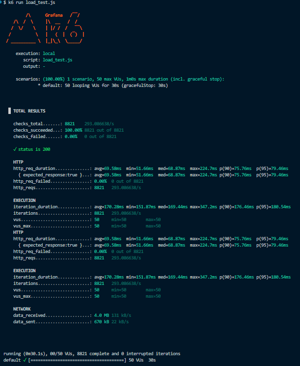
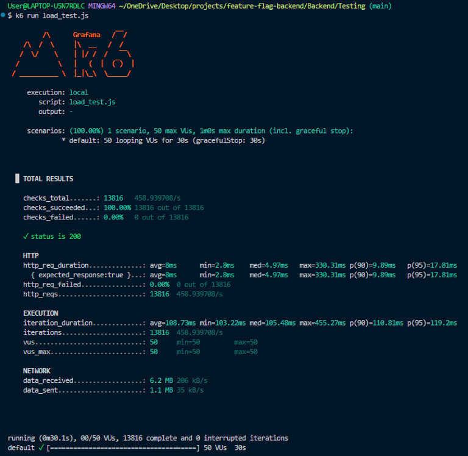

# Feature Flag Management System

A high-performance backend service for managing feature flags in real-time. This system enables controlled feature rollouts, soft deletes, and dynamic configuration updates without client redeployment.

It is designed for scale, utilizing **Redis caching** to drastically reduce database load and improve response times.

## 🚀 Key Features

* **CRUD Operations:** Create, Read, Update, and Delete feature flags.
* **Rollout Strategy:** Precise control over feature visibility using `rollout_percentage`.
* **Soft Delete:** Flags are marked inactive rather than permanently removed.
* **High Performance:** Optimized with Redis caching (benchmarked with k6).

## 🧠 Design Decisions

### Why Soft Delete?
Instead of permanently removing records from the database (**Hard Delete**), this system implements **Soft Delete** (setting an `is_deleted` flag to `true`).

* **Data Recovery:** Prevents accidental data loss. If a feature flag is deleted by mistake, it can be easily restored.
* **Audit Trails:** Maintains a historical record of all feature flags that ever existed, which is critical for debugging past system behaviors.
* **Data Integrity:** Ensures that analytics or logs referencing an old feature flag ID remain valid even after the flag is "deleted" from the active UI.

## 🛠️ Tech Stack

* **Runtime:** Node.js v20+
* **Framework:** Express.js
* **Database:** PostgreSQL
* **Caching:** Redis
* **Testing:** k6 (Load Testing)

---

## ⚡ Performance Engineering & Redis Optimization

To ensure scalability, I implemented a **Redis caching layer**. Below is the impact analysis comparing direct Database queries vs. Redis caching strategies under a load of **50 Concurrent Virtual Users**.

### 1. Latency Improvement (Response Time)
We measured the **Average Response Time** for API requests.

* **Without Redis:** `69.58ms`
* **With Redis:** `8ms`

> **Result:** Redis reduced the average API latency by **88.5%**, ensuring near-instant responses even under load.

| Metric | Before Optimization | After Optimization | Improvement |
| :--- | :--- | :--- | :--- |
| **Average Latency** | 69.58ms | **8ms** | 🔻 **88.5%** Faster |
| **P95 Latency** | 79.46ms | **17.81ms** | 🔻 **77.6%** Faster |

### 2. Throughput Increase (Capacity)
We stress-tested the API to determine the maximum **Requests Per Second (RPS)** the system could handle.

* **Without Redis:** `293 req/s`
* **With Redis:** `458 req/s`

> **Result:** The system throughput increased by **56.3%**, allowing it to handle significantly more concurrent traffic.

#### Benchmark Evidence

<table>
  <tr>
    <th width="50%">Before Caching (Baseline)</th>
    <th width="50%">After Caching (Optimized)</th>
  </tr>
  <tr>
    <td></td>
    <td></td>
  </tr>
</table>
---

## 📡 API Documentation

### 1. Create a Feature Flag
Initialize a new flag with a specific rollout percentage.
* **Endpoint:** `POST /flag`
* **Request Body:**
    ```json
    {
      "name": "modal comment section",
      "description": "the fourth feature",
      "rollout_percentage": 60
    }
    ```
* **Success Response (200 OK):**
    ```json
    {
      "message": "flag creation succesfull",
      "flag": {
        "id": 4,
        "name": "modal comment section",
        "description": "the fourth feature",
        "rollout_percentage": 60,
        "is_active": true,
        "is_deleted": false,
        "created_at": "2025-12-21T10:03:31.468Z",
        "updated_at": "2025-12-21T10:03:31.468Z"
      }
    }
    ```

### 2. Get All Flags
Retrieve all flags. If cached, data is served from Redis; otherwise, it is fetched from Postgres and then cached.
* **Endpoint:** `GET /flag`
* **Success Response (200 OK):**
    ```json
    {
      "flags": [
        {
          "id": 1,
          "name": "dark-mode",
          "description": "to make the experience of the user better",
          "rollout_percentage": 30,
          "is_active": true,
          "is_deleted": false
        },
        {
          "id": 2,
          "name": "2nd feature",
          "rollout_percentage": 50,
          "is_active": false,
          "is_deleted": true
        }
      ]
    }
    ```

### 3. Get Flag by ID
Fetch details for a single flag.
* **Endpoint:** `GET /flag/:id`
* **Success Response (200 OK):**
    ```json
    {
      "flag": {
        "id": 4,
        "name": "modal comment section",
        "description": "the fourth feature",
        "rollout_percentage": 60,
        "is_active": false,
        "is_deleted": true,
        "created_at": "2025-12-21T10:03:31.468Z",
        "updated_at": "2025-12-21T10:06:26.030Z"
      }
    }
    ```

### 4. Update Feature Flag
Modify a flag's status or rollout percentage.
* **Note:** This operation automatically **invalidates the related Redis cache key** to ensure data consistency.
* **Endpoint:** `PUT /flag/:id`
* **Request Body:**
    ```json
    { "is_active": false }
    ```
* **Success Response (200 OK):**
    ```json
    {
      "message": "field updated for id = 4",
      "flag": {
        "id": 4,
        "name": "modal comment section",
        "rollout_percentage": 60,
        "is_active": false,
        "is_deleted": false
      }
    }
    ```

### 5. Delete Flag (Soft Delete)
Marks a flag as deleted without removing it permanently.
* **Endpoint:** `DELETE /flag/:id`
* **Success Response (200 OK):**
    ```json
    {
      "message": "flag with id->4 has been marked as deleted ",
      "flag": {
        "id": 4,
        "name": "modal comment section",
        "is_active": false,
        "is_deleted": true
      }
    }
    ```

---

## 🏃‍♂️ How to Run Locally

1.  **Clone the repository:**
    ```bash
    git clone [https://github.com/your-username/feature-flag-backend.git](https://github.com/your-username/feature-flag-backend.git)
    cd feature-flag-backend
    ```

2.  **Install dependencies:**
    ```bash
    npm install
    ```

3.  **Setup Environment Variables:**
    Create a `.env` file in the root directory:
    ```env
    DB_USER=postgres
    DB_PASSWORD=your_password
    DB_HOST=localhost
    DB_PORT=5432
    DB_DATABASE=feature_flags
    REDIS_HOST=localhost
    REDIS_PORT=6379
    ```

4.  **Start the Server:**
    ```bash
    node server.js
    ```
    *Server runs on `http://localhost:5000`*